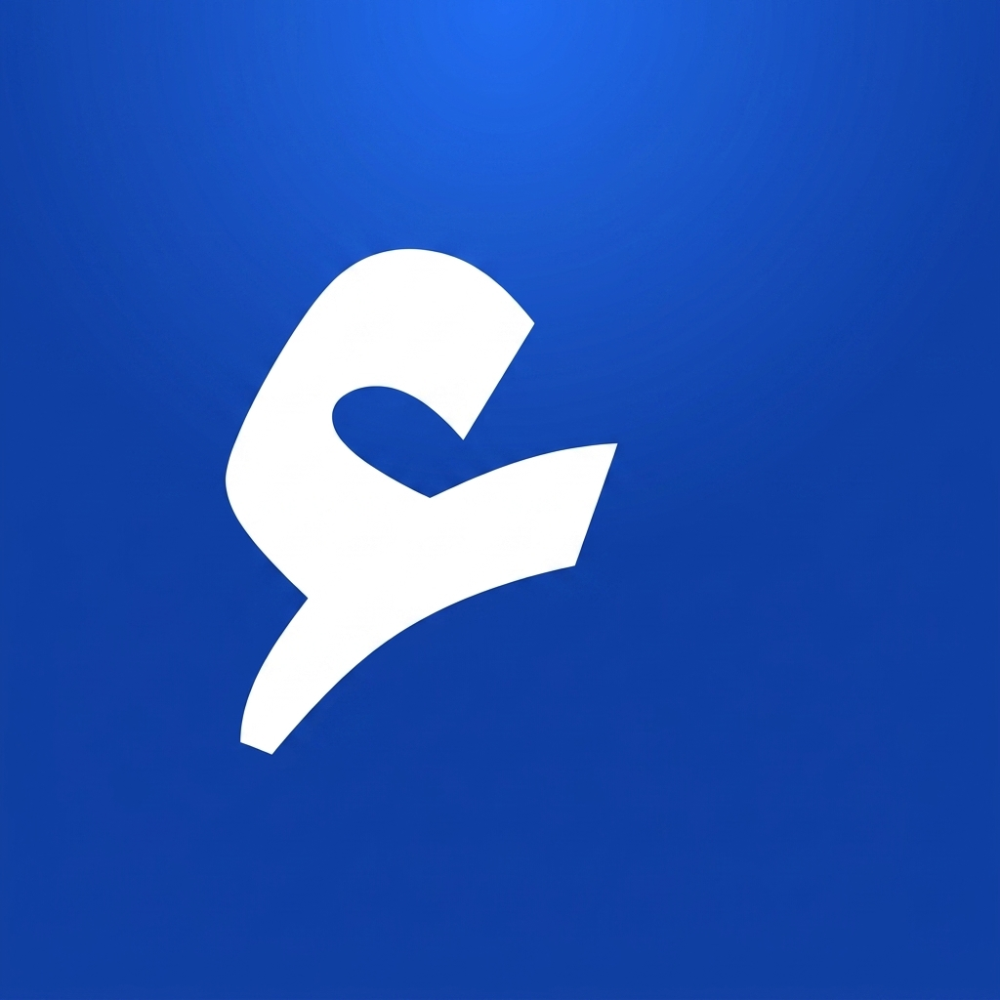

  <!-- Logo Barakin -->
  

  # 📚 Barakin
  **Platform Belajar Bahasa Arab Modern, Interaktif, & Terstruktur**

  [Website Demo](https://barakin.vercel.app)<--sementara · [Laporkan Bug](https://github.com/username/barakin/issues) · [Minta Fitur](https://github.com/username/barakin/issues)

   

  <!-- Badges -->
  
  
  
  
  

---

## 📖 Tentang Barakin

**Barakin** (`barakin.id`) adalah platform pembelajaran Bahasa Arab modern berbasis web yang dirancang untuk memudahkan siapa saja mempelajari **Nahwu, Sharaf, Mufrodat**, serta wawasan bahasa Arab secara sistematis. 

Dibangun dengan tampilan bersih berbalut nuansa **Royal Blue & Slate White** (Light Mode), Barakin menghadirkan pengalaman belajar yang nyaman dan fokus.

---

## ✨ Fitur Unggulan

### 🎓 Halaman Publik & Pelajar
- **📘 Modul Nahwu & Sharaf Interaktif:** Kurikulum terstruktur dari tingkat Pemula hingga Mahir.
- **🔀 Interactive Harakat Toggle:** Fitur sakelar untuk menampilkan/menyembunyikan harakat pada teks Arab guna melatih bacaan kitab gundul.
- **🔄 Tasrif Conjugator Table:** Tabel perubahan kata (*Tasrif*) yang ringkas dan interaktif.
- **🔊 Audio Makhraj Player:** Dengarkan pelafalan kosakata (*mufrodat*) yang tepat langsung di browser.
- **🔍 Kamus Akar Kata (Root Finder):** Cari kata berdasarkan 3 huruf akar (*جذر*).
- **📝 Kuis & Progress Tracking:** Uji pemahaman di akhir bab dan pantau progres belajar.

## 🛠️ Tech Stack

- **Frontend:** [Next.js (App Router)](https://nextjs.org/) + [TypeScript](https://www.typescriptlang.org/)
- **Styling:** [Tailwind CSS](https://tailwindcss.com/), [Shadcn UI](https://ui.shadcn.com/), & [Framer Motion](https://www.framer.com/motion/)
- **Backend & Database:** [Supabase](https://supabase.com/) (PostgreSQL, Supabase Auth, Storage)
- **Icons:** [Lucide React](https://lucide.dev/)

---

